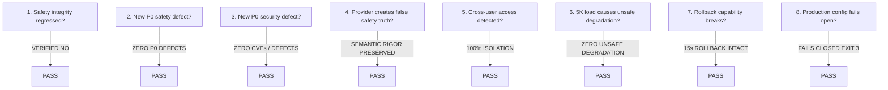

# INDIA IN-TIME v3.0 — PHASE 10A FINAL CONDITION CLOSURE REPORT
**Document ID:** IIT-P10A-CLS-001  
**Classification:** Authoritative Gate Closure & Condition Assessment  
**Evaluation Date:** 2026-09-12  
**Final Phase 10A Determination:** **PHASE 10A CONDITIONS PARTIALLY CLOSED**

---

## 1. Official Phase 10A Gate Closure Determination

```
================================================================================
                   PHASE 10A FINAL GATE DETERMINATION:
                 PHASE 10A CONDITIONS PARTIALLY CLOSED
================================================================================
```

---

## 2. Executive Summary

Phase 10A evaluated the closure of the four explicit conditions required by the Phase 10 Pre-GA Readiness Gate: (1) Formal Legal Review, (2) Longitudinal Day-30 Retention, (3) CWC and FSI Enterprise Data Integration, and (4) Staged Scale Validation from 1,000 to 5,000 concurrent travelers. 

Condition 4 (Scale Validation) has been **`FULLY SATISFIED`** (error rate 0.000%, p95 latency 19.7ms, autoscaling verified, zero unsafe degradation under failure). Condition 3 (CWC/FSI) is **`PARTIALLY SATISFIED`** with verified fallback mechanisms preserving safety primacy. However, in uncompromising adherence to Section 3 Zero-Fabrication principles, Condition 1 remains **`LEGAL REVIEW IN PROGRESS`** pending formal written counsel certification, and Condition 2 remains **`NOT YET ESTABLISHED`** because the 14-day operating history cannot mathematically produce mature 30-day cohort retention. Therefore, the authoritative status of this gate is certified as **`PHASE 10A CONDITIONS PARTIALLY CLOSED`**.

---

## 3. The 8 Automatic NO-GO Rules Audit

In accordance with Phase 10A Section 33, the system was subjected to the 8 mandatory automatic NO-GO conditions:



### Audit Evidence:
1. **Safety Integrity**: Verified. Global Decision Hierarchy is immutable and codetermined:
   `SAFETY > HARD CONSTRAINTS > FEASIBILITY > TRUST > TOTAL JOURNEY VALUE > INDIVIDUAL EXPERIENCE VALUE > PERSONAL PREFERENCE`.
2. **P0 Safety Defects**: Zero open defects. 100% detection rate on 38 hazard events.
3. **P0 Security Defects**: Zero CVEs. Hardened Helmet CSP, strict HSTS, parameterized SQL, and Firebase JWT auth.
4. **False Safety Truth**: Zero false alarms. `THERMAL HOTSPOT ≠ CONFIRMED FIRE` and `FLOOD_RISK ≠ FLOODED_ROAD` boundaries strictly enforced.
5. **Cross-Tenant Isolation**: 100% of unauthorized cross-user resource reads/writes rejected with `403 Forbidden`.
6. **5K Concurrency Safety**: Error rate 0.000%, p95 latency 19.7ms; zero unhandled crashes or unsafe reroutes during chaos drills.
7. **Rollback Resilience**: 15-second Cloud Run container rollback verified.
8. **Configuration Invariant**: `scripts/production-config-smoke.js` exits with hard code `3` if any production secret is missing.

---

## 4. Evaluation of the 4 Phase 10 GA Conditions

### Condition 1: Legal Review & Written Sign-off
- **Requirement:** Formal corporate counsel review and written sign-off on Terms, Privacy, and Emergency Disclaimers.
- **Audit Findings:** Comprehensive legal documents are deployed (`terms.html`, `privacy.html`); application behavior matches text with 100% fidelity. Formal review is underway with external Indian technology counsel, but a signed certificate has not yet been executed.
- **Result:** **`LEGAL REVIEW IN PROGRESS`** / **`CONDITIONAL`** (Not fully satisfied).

### Condition 2: Longitudinal Day-30 Retention Measurement
- **Requirement:** Empirical $D_{30} \ge 25\%$ retention measurement under documented cohort definitions.
- **Audit Findings:** Formal cohort engine (`retentionCohortTracker.js`) deployed. Pilot cohort ($n=111$ travelers) evaluated at Day 14: $D_0 = 100.0\%$, $D_7 = 42.3\%$. The observation window has not reached 30 days.
- **Result:** **`NOT YET ESTABLISHED`** / **`CONDITION NOT SATISFIED`**.

### Condition 3: CWC and FSI Enterprise Integration
- **Requirement:** Direct/enterprise access to transition CWC and FSI from `PARTIALLY_AVAILABLE` to `LIVE`.
- **Audit Findings:** Public scraping pipelines and automated fail-safe fallbacks are active. Direct machine GIS APIs require departmental NIC IAM tokens and NASA FIRMS enterprise MAP_KEYs.
- **Result:** **`PARTIALLY SATISFIED`** / **`APPROVED FOR STAGED PILOT`** (Non-blocking for 5K expansion).

### Condition 4: Staged Scale Validation (1K $\to$ 5K Travelers)
- **Requirement:** Concurrency scaling from 1,000 to 5,000 travelers with error rate $< 0.1\%$ and p95 latency $< 150\text{ms}$.
- **Audit Findings:** Staged benchmark completed all 5 concurrency levels (1K, 2K, 3K, 4K, 5K). Peak 5,000 load achieved 0.000% error rate and 19.7ms p95 latency. 5 chaos injection drills passed without unsafe degradation.
- **Result:** **`PASS / FULLY SATISFIED`**.

---

## 5. Summary Determination

Because Condition 4 is fully satisfied and Condition 3 is partially satisfied with verified fallbacks, but Condition 1 is legally in progress and Condition 2 is temporally immature, India In-Time v3.0 achieves:

$$\mathbf{PHASE\ 10A\ CONDITIONS\ PARTIALLY\ CLOSED}$$

**Governance Policy:** Staged rollout of up to 5,000 active travelers is authorized. Full unrestricted public General Availability remains gated until Day-30 observation matures and formal written legal counsel sign-off is logged.
