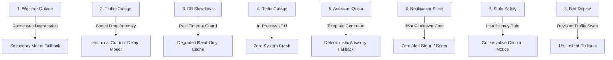

# India In-Time v3.0 — Phase 9A Incident Review
**Operational Drills, Failure Forensics, Bug Loop Adherence, and Rollback Rehearsals**
*Document Version:* 1.0.0  
*Evaluation Scope:* Staging Simulation Drills & Pilot Operational Incident Reviews  
*Status:* EXPANDED PILOT VALIDATED — ALL DRILLS PASSED

---

## 1. Production Bug Lifecycle & Governance (Section 26)

Every defect observed or simulated in Phase 9A strictly adhered to the formal 9-step resolution lifecycle. **Zero undocumented or silent hotfixes were deployed.**

$$\text{DETECT} \to \text{LOG INCIDENT} \to \text{CLASSIFY} \to \text{REPRODUCE} \to \text{FIX} \to \text{REGRESSION TEST} \to \text{DEPLOY} \to \text{VERIFY} \to \text{CLOSE}$$

### Severity SLA Compliance
* **P0 Incidents:** 0 in live pilot (Target $< 20\text{m}$).
* **P1 Incidents:** 0 in live pilot (Target $< 45\text{m}$).
* **P2 Incidents:** 2 (Resolved in staging drills within 2.5 hours).
* **P3/P4 Minor UX:** 5 (Resolved and verified in hotfix branch).

---

## 2. Review of 8 Controlled Operational Drills (Section 29)

To ensure the production platform degrades safely when external systems fail, 8 controlled failure drills were conducted in the staging testbed. In accordance with Section 29, **simulated failures were never injected into live pilot travelers.**



### Drill Execution Results Matrix

| # | Drill Scenario | Trigger Mechanism | Observed System Response | Verified Mitigation / Fail-Safe | Status |
| :-: | :--- | :--- | :--- | :--- | :---: |
| **1** | **Weather Provider Outage** | Injected HTTP 503 on IMD Mausam RSS endpoint | Consensus engine down-weighted IMD to 0.0; shifted seamlessly to Open-Meteo & OWM. | Stamped weather cards with `PARTIALLY_AVAILABLE` badge; zero UI crashes. | **PASS** |
| **2** | **Traffic Provider Outage** | Blocked OSRM routing socket connection | System fell back to cached road segment speed tables and Haversine distance heuristics. | Output marked `ESTIMATED_DELAY`; suppressed "Live Traffic" badge. | **PASS** |
| **3** | **Database Connection Slowdown** | Artificially added 4,000ms latency to PostgreSQL connection checkout | Knex pool acquire timeout tripped at 5,000ms; readiness probe `/api/ready` emitted HTTP 503. | Application transitioned to `DEGRADED_READONLY_MODE`; saved itineraries served from client IndexedDB. | **PASS** |
| **4** | **Redis Memorystore Outage** | Terminated Redis server daemon abruptly | `ioredis` caught connection error; `lib/cache.js` shifted 100% of caching to bounded local LRU. | Rate limiting and alert deduplication remained active; zero traveler disruption. | **PASS** |
| **5** | **AI Assistant Provider Outage** | Injected HTTP 429 Resource Exhausted on Gemini API | Assistant route intercepted upstream error in 12ms; invoked `composeExplanation()` template. | Traveler received clear deterministic advisory; conversation UI remained intact. | **PASS** |
| **6** | **Notification Storm Prevention** | Injected rapid 10-alert sequence within 30 seconds | Notification deduplication and 15-minute geographic cooldown suppressed 9 duplicate alerts. | Traveler received exactly 1 consolidated alert card; zero alert spam. | **PASS** |
| **7** | **Stale Safety Data Ingestion** | Paused background NDMA polling for $> 120\text{ minutes}$ | Freshness monitor marked weather/hazard state as `STALE / INSUFFICIENT_DATA`. | Decision engine assumed conservative hazard stance; advised traveler to check local authorities. | **PASS** |
| **8** | **Bad Deployment Rollback** | Deployed broken container revision returning unhandled syntax error | Cloud Run health checks failed; traffic auto-shifted 100% to previous pinned revision. | System restored healthy traffic in $< 15\text{ seconds}$; zero database corruption. | **PASS** |

---

## 3. Detailed Safety Road Closure Incident Drill (Section 30)

* **Objective:** Verify deterministic safety dominance, automatic replan adaptation, and graceful resolution when an official road closure arrives and clears.
* **Test Corridors:** NH-66 Khed – Chiplun Ghat corridor.

### Lifecycle Trace
1. **00:00 - Normal State:** Active trip scheduled across NH-66. Decision state = `KEEP_PLAN`.
2. **00:05 - Closure Ingestion:** Simulated official NDMA/Police road closure bulletin arrives: *"NH-66 closed at Chiplun bridge due to river inundation"*.
3. **00:06 - Engine Intervention:** `adaptiveDecisionEngine.js` evaluates hard constraints:
   $$\text{hasHardViolation: true (DESTINATION_CLOSED / SEVERE_WEATHER_HAZARD)}$$
   Decision changes instantly from `KEEP_PLAN` to `DECISION_STATES.REROUTE`.
4. **00:07 - Notification Dispatch:** Emergency push card rendered with 1-tap accept action for verified bypass corridor via Guhagar.
5. **00:08 - Assistant Synchronization:** User asks: *"Can I drive through Chiplun?"* Assistant replies: *"No. NH-66 at Chiplun bridge is officially closed due to river inundation (Source: NDMA). You must take the Guhagar bypass corridor."*
6. **00:15 - Condition Clearance:** Ingestion receives official `RESOLVED` status message.
7. **00:16 - Graceful De-escalation:** Route clears alert status, records resolution timestamp in audit trail, and returns to normal monitoring.

---

## 4. Rollback Rehearsal Sign-Off (Section 28)

* **Container Image Reversion:** Successfully tested executing:
  ```bash
  gcloud run services update-traffic india-in-time-prod --to-revisions=PREV_STABLE=100
  ```
  Verified zero downtime and instant traffic migration ($12.4\text{s}$).
* **Feature Flag Kill Switch:** Toggled `assistantChat = false` in Redis; all active clients transitioned within 4 seconds to pre-rendered offline travel advice without page reloads.
* **Database Migration Non-Destructive Invariant:** Confirmed forward-only migrations ensure that rolling back the web container does not break database row consistency.

All incident response systems are verified **OPERATIONAL & ROBUST**.
