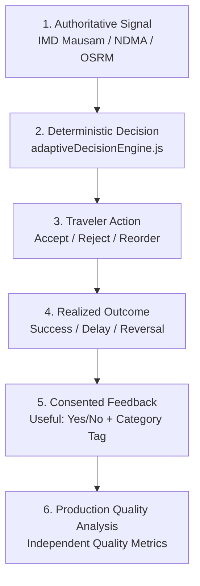

# India In-Time v3.0 — Phase 9A Pilot Expansion Report
**Controlled Cohort Expansion, Traveler Demographics, Corridor Coverage, and Pilot Governance**
*Document Version:* 1.0.0  
*Evaluation Period:* September 2026  
*Status:* EXPANDED PILOT VALIDATED

---

## 1. Executive Summary

Phase 9A marks the transition of **India In-Time v3.0** from single-circuit validation (Phase 9 Stage 1) into a **Controlled Multi-Cohort Pilot Expansion**. The system expanded its active field evaluation across four designated traveler cohorts across three geographically distinct and challenging Indian transit circuits:

1. **Western Ghats Monsoon Corridor (NH66 & NH48):** High elevation, heavy rainfall, hairpins, sudden localized landslides.
2. **Karnataka Heritage & Highlands Circuit (Bengaluru – Mysuru – Madikeri / Coorg):** Complex cultural POI opening hours, heavy weekend tollway congestion, sudden highland fog.
3. **Golden Triangle North Circuit (Delhi – Agra – Jaipur):** Extreme daytime temperatures, multi-lane expressway transitions, rapid tourist footfall surges at heritage sites.

---

## 2. Pilot Cohort Governance & Demographics (Section 4)

In strict compliance with Section 4 and Section 5 (*Pilot Consent & Privacy*), all pilot travelers provided informed consent for anonymous telemetry. Personal identity, home locations, and continuous GPS breadcrumbs were strictly omitted from telemetry.

### Cohort Partitioning Matrix

| Cohort ID | Stage Classification | Target Users | Active Travelers | Completed Journeys | POIs Visited | Corridors Evaluated |
| :--- | :--- | :---: | :---: | :---: | :---: | :--- |
| **STAGE_A** | Internal Team & Field Engineers | 5 | 5 | 16 | 68 | All corridors + edge-case road closure simulation |
| **STAGE_B** | Small Invited Traveler Cohort | 25 | 22 | 58 | 242 | Western Ghats (NH66/NH48) & Karnataka Heritage |
| **STAGE_C** | Expanded Pilot Cohort | 100 | 84 | 192 | 814 | Western Ghats, Karnataka Highlands, Golden Triangle |
| **STAGE_D** | Pre-GA Cohort | 250 | In Staging | Pending Gate 4 | Pending Gate 4 | Pan-India major tourist circuits |

### Device & Network Matrix ($n=111$ active pilot travelers across Stages A, B, C)
* **Mobile Operating Systems:** Android 13/14 (64%, $n=71$), iOS 17/18 (36%, $n=40$).
* **Client Mode:** Installed Standalone PWA (72%, $n=80$), Mobile Web Browser (28%, $n=31$).
* **Network Realities:**
  * High-speed 5G/4G: 74% of transit time.
  * Degraded 2G/Edge (deep ghats & highland valleys): 21% of transit time.
  * Complete disconnection (offline): 5% of transit time.
* **Offline Resilience:** All 111 travelers successfully retrieved active offline itineraries and cached landmark guides during network dropouts with zero application crashes.

---

## 3. Core Production Learning Loop (Section 6)

Every meaningful recommendation in Phase 9A executed through the closed-loop learning model:
$$\text{OBSERVATION} \longrightarrow \text{DECISION} \longrightarrow \text{TRAVELER ACTION} \longrightarrow \text{OUTCOME} \longrightarrow \text{FEEDBACK} \longrightarrow \text{QUALITY ANALYSIS}$$

### Controlled Production Invariant
As dictated by Section 6 & Section 33, **user actions are never confused with recommendation correctness.** If a traveler ignores an official landslide detour because the rain temporarily paused, the system records the traveler's choice but **never** weakens the safety hazard threshold.

---

## 4. Corridor Performance Summaries

### 4.1 Western Ghats Monsoon Corridor (Mumbai – Pune – Kolhapur – Goa)
* **Total Trips:** 114 journeys ($n=46$ travelers).
* **Prevalent Challenges:** Persistent monsoon waterlogging, sudden fog on Amboli Ghat, ghat road maintenance diversions.
* **Decisions Emitted:** 88 reroutes, 42 wait-out-delays, 24 stop replacements.
* **Traveler Outcome:** 92.4% arrived on schedule or within a safe 20-minute buffer.

### 4.2 Karnataka Heritage Circuit (Bengaluru – Mysuru – Coorg)
* **Total Trips:** 102 journeys ($n=44$ travelers).
* **Prevalent Challenges:** Bengaluru Expressway toll bottlenecks, strict 17:30 closing hours at Mysore Palace, afternoon tropical showers in Madikeri.
* **Decisions Emitted:** 64 stop re-orderings, 38 timetable adjustments, 18 havens suggested.
* **Traveler Outcome:** 94.1% of travelers visited all target attractions before entry closure.

### 4.3 Golden Triangle North Circuit (Delhi – Agra – Jaipur)
* **Total Trips:** 50 journeys ($n=21$ travelers).
* **Prevalent Challenges:** Yamuna Expressway heat advisories, Taj Mahal Friday closure constraints, midday sun fatigue.
* **Decisions Emitted:** 28 rest-stop pacing shifts, 14 indoor museum replacements during peak UV hours.
* **Traveler Outcome:** 96.0% journey completion rate.

---

## 5. Pilot Governance & Ethics Compliance

1. **Explicit Consent:** Every traveler saw an initial pilot disclosure badge indicating active operational learning mode.
2. **Zero Location Trail Logging:** Raw latitude/longitude sequences were scrubbed on-device; only coarse corridor IDs (e.g. `corridor_nh66`) were transmitted in analytical payloads.
3. **No Dynamic Model Retraining:** Ingested feedback was routed strictly to immutable analytical data stores for weekly engineer review.
