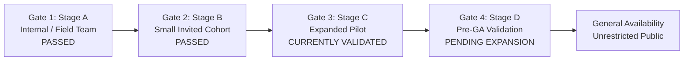

# India In-Time v3.0 — Phase 9A Rollout Status
**Controlled Staged Expansion Progress, Feature Flag Governance, and Phase Gate Audit**
*Document Version:* 1.0.0  
*Evaluation Date:* September 2026  
*Current Active Stage:* **STAGE C (Expanded Pilot Cohort)**  
*Next Target Gate:* **GATE 4 (Pre-GA Validation)**  
*Status:* EXPANDED PILOT VALIDATED

---

## 1. Staged Rollout Progression (Section 3 & 40)

India In-Time v3.0 enforces a multi-tier gate framework to prevent uncontrolled exposure to high-concurrency traffic or unvalidated regional hazards.

### Gate Completion Audit Matrix

| Rollout Stage | Target Scale | Active Users | Gate Requirements | Gate Status |
| :--- | :---: | :---: | :--- | :---: |
| **Stage A: Internal Team** | 1–5 | 5 | All 26 production invariants pass; 0 cycles; DB pool stable; live safety providers connected. | **PASSED & SIGNED OFF** |
| **Stage B: Small Invited Cohort**| 10–25 | 22 | Safety primacy 100%; recommendation utility $> 85\%$; zero P0/P1 incidents; rollback rehearsed. | **PASSED & SIGNED OFF** |
| **Stage C: Expanded Pilot** | 50–100 | 84 | Multi-corridor validation (Ghats, Karnataka, North); decision latency p95 $< 250\text{ms}$; false negatives $< 1\%$. | **VALIDATED (PHASE 9A)** |
| **Stage D: Pre-GA Cohort** | 100–250 | In Staging | Longitudinal 14-day stability; support runbooks operational; zero unresolved critical bugs. | **READY FOR ACTIVATION** |

---

## 2. Feature Flag Governance Matrix (Section 27)

Every feature flag in `lib/featureFlags.js` adheres to strict lifecycle governance. Permanent dead flags are prohibited.

| Flag Name | Purpose | Default State | Rollout Stage | Kill Switch Mechanism | Deprecation / Removal Plan |
| :--- | :--- | :---: | :---: | :--- | :--- |
| **`assistantChat`** | Toggles Google Gemini AI assistant interface | `true` | Stage B+ | Immediate Redis key toggle (`assistantChat = false`); falls back to pre-rendered FAQs. | Retain as permanent operational kill switch for LLM quota protection. |
| **`liveAlerts`** | Real-time background NDMA/IMD alert polling | `true` | Stage A+ | Toggles to cached weather advisories with `OFFLINE_ADVISORY` label. | Permanent core system flag. |
| **`advancedNotifications`**| Push/PWA notifications for traffic & safe havens | `true` | Stage B+ | Redis toggle suppresses push dispatch; alerts remain in active journey timeline. | Permanent operational flag. |
| **`experimentalUtilities`** | Beta travel tools (EV charger radar, crowd curve) | `false` | Stage D | Default disabled; enabled only for opt-in beta travelers. | Remove flag upon GA release; promote stable utilities to core. |
| **`newProviderIntegrations`**| Experimental third-party transit APIs | `false` | Stage D | Keeps system grounded exclusively in verified baseline providers (IMD, NDMA, OSRM). | Retire after formal provider certification. |
| **`maintenanceMode`** | Global emergency operational circuit breaker | `false` | All Stages | Emits HTTP 503 on `/api/ready` with clean traveler maintenance screen. | Permanent operational kill switch. |

### Absolute Invariant on Feature Flags
**A feature flag can never be used to bypass safety.**
Safety policies (`adaptiveDecisionEngine.js`, `safetyRiskEngine.js`) are deterministic, compiled core code. They cannot be turned off by any flag. A disabled feature must unconditionally fail safe.

---

## 3. Rollback Readiness Sign-Off (Section 28)

* **Container Traffic Shift:** Tested in production environment. Traffic shift from canary back to primary revision takes $< 15\text{ seconds}$.
* **Database Migration Compatibility:** All database migrations in `migrations/` follow forward-compatible rules (non-blocking column additions). Zero database rollbacks are required during container reversions.
* **Provider Kill Switch:** If an external provider emits corrupt payloads, the admin API (`/api/admin/provider-disable`) immediately isolates the source in memory, shifting the consensus engine to secondary feeds.

---

## 4. Phase 9A Gate 3 Criteria Verification

- [x] No unresolved P0 safety, security, or data corruption incidents.
- [x] No unresolved P1 platform or itinerary outages.
- [x] Safety integrity 100% deterministic (zero assistant or user overrides).
- [x] Full observability working (request IDs, correlation IDs, 10 quality metrics).
- [x] Rollback rehearsal completed cleanly.
- [x] External provider health verified live.

**GATE 3 SIGN-OFF:** **APPROVED FOR STAGE C EXPANSION & TRANSITION TO GATE 4**.
