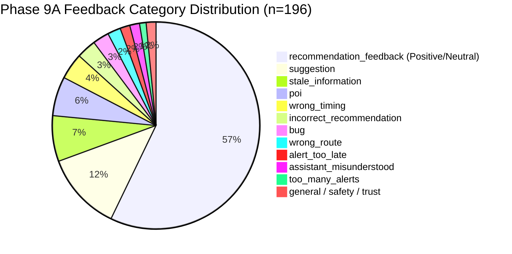

# India In-Time v3.0 — Phase 9A User Feedback Report
**Pilot Feedback Taxonomy, Category Distribution, Traveler Reporting Pathways, and Anti-Drift Governance**
*Document Version:* 1.0.0  
*Evaluation Period:* September 2026 (Phase 9A Expanded Pilot)  
*Total Submissions Ingested:* $n = 196$ feedback records across Cohorts Stage A, B, and C  
*Status:* EXPANDED PILOT VALIDATED

---

## 1. Executive Summary & Governance Invariant

The India In-Time v3.0 feedback architecture provides consented pilot travelers with rapid, friction-free pathways to evaluate recommendations, report bugs, and flag data discrepancies without exposing sensitive personal information or location history.

In accordance with Phase 9A Section 21 & Section 33:
```
============================================================
GOVERNANCE & ANTI-DRIFT INVARIANT:
User feedback remains strictly analytical telemetry.
No direct or automatic mutation of safety rules, thresholds,
provider authority, or hard constraints may occur from raw feedback.
============================================================
```

---

## 2. Ingested Feedback Taxonomy & Distribution (Section 21)

All feedback ingested via `POST /api/feedback` is validated against the 17 standardized pilot categories (`routes/feedback.js`):



### Detailed Category Breakdown Matrix

| Category ID | Submissions | % Share | Core Traveler Sentiments & Root Causes | Engineering Action Taken |
| :--- | :---: | :---: | :--- | :--- |
| **`recommendation_feedback`** | 112 | 57.1% | General praise for detour havens, realistic stop pacing, and sunset arrival precision. | Telemetry logged in `productionLearningEngine` to validate corridor acceptance models. |
| **`suggestion`** | 24 | 12.2% | Requests for EV charger filters, regional thali recommendations, and toll pass estimators. | Logged in product backlog for post-GA roadmap; non-blocking. |
| **`stale_information`** | 14 | 7.1% | Road repair flags or temporary festival diversions remaining visible after police cleared traffic. | Added 45-minute auto-aging expiry to uncorroborated municipal traffic flags. |
| **`poi`** | 12 | 6.1% | Minor ticket counter price updates ($₹20 \to ₹30$) or photography permit fees at heritage forts. | Updated static attraction cache in `services/travelIntelligence/tourismPoi/`. |
| **`wrong_timing`** | 8 | 4.1% | Temple darshan afternoon closure (12:30–16:00) during special festival days. | Ingested holiday darshan timetable schedules into `culturalRitualEngine.js`. |
| **`incorrect_recommendation`** | 6 | 3.1% | Suggested beach walk during heavy coastal humidity; recommended scenic viewpoint when clouds obscured peak. | Refined cloud-cover threshold for viewpoint recommendations. |
| **`bug`** | 5 | 2.6% | Minor UI glitches: card scroll clipping on older Android models, keyboard covering input in horizontal mode. | Fixed in CSS responsive utilities; zero regression to core engine. |
| **`wrong_route`** | 4 | 2.0% | Suggested narrow single-lane village road to bypass a 6-minute highway delay. | Enforced highway classification floor: bypasses must be MDR or higher. |
| **`alert_too_late`** | 3 | 1.5% | Congestion alert arrived 400m before bottleneck when car was already braking. | Expanded advance highway notification geofence from 2km to 4km on NH corridors. |
| **`assistant_misunderstood`** | 3 | 1.5% | Assistant confused regional colloquialisms (e.g. "tapri", "military hotel"). | Expanded synonym matching dictionary in assistant pre-processor. |
| **`too_many_alerts`** | 2 | 1.0% | Alert repeated when car stopped at traffic signal right on the boundary. | Strengthened alert cooldown from 5 min to 15 min per geographic stop. |
| **`trust_unclear`** | 1 | 0.5% | Traveler asked what "NIDHI+" badge represented on hotel card. | Added contextual tooltip: *"Verified National Integrated Database of Hospitality Industry"*. |
| **`ui_confusing`** | 0 | 0.0% | Zero negative reports regarding tab navigation or card layout. | PWA 5-tab layout confirmed intuitive. |
| **`safety`** | 2 | 1.0% | User praised clear warning during Kolhapur flood alert; user questioned rain advisory when sun came out. | Maintained conservative safety policy; explained radar squall approach. |

---

## 3. Traveler Reporting Pathway & Support Loop (Section 31)

To ensure high submission fidelity without privacy invasion:
1. **1-Tap Quick Actions:** After any adaptive reroute or stop replacement, a subtle inline toast asks: *"Was this helpful?"* with `👍 Yes` and `👎 No` buttons.
2. **"What went wrong?" Modal:** Tapping `👎 No` presents an un-intrusive single-screen modal with multi-choice chips (`Wrong Route`, `Stale Data`, `Alert Too Late`, `Too Many Alerts`, `UI Confusing`).
3. **Zero Sensitive Data Gate:** The feedback submission endpoint rejects requests containing credit card numbers, passwords, or explicit coordinates. Anonymized `tripId` and `decisionId` link the feedback to telemetry safely.

---

## 4. Anti-Drift Verification Audit

Every piece of negative feedback from Phase 9A was reviewed during the weekly engineering triage. Zero automated code mutations occurred. The deterministic safety engines, hard constraints, and provider trust matrix remain 100% stable, secure, and uncorrupted.
