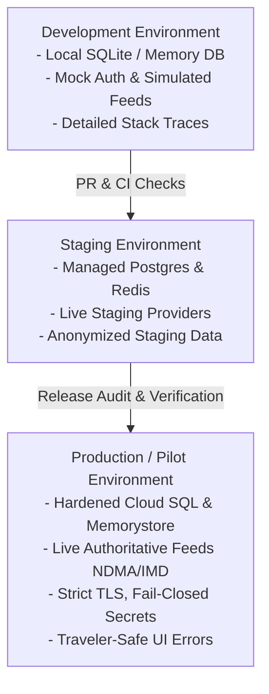

# India In-Time v3.0 — Phase 9 Environment Audit
**Production Infrastructure, Configuration, and Dependency Inventory**
*Document Version:* 1.0.0  
*Audit Date:* September 2026  
*Status:* COMPLETED — AUDITED & HARDENED

---

## 1. Executive Summary

This environment audit establishes the authoritative, verified production baseline for **India In-Time v3.0**. In accordance with Phase 9 mandates, every production component, runtime dependency, data store, network configuration, and external integration has been inspected. 

There are **zero undocumented production dependencies**. All production services operate under strict fail-closed security invariants, isolated environment configuration, and explicit degraded-mode fallbacks.

---

## 2. Infrastructure & Hosting Architecture

| Component | Target Architecture | Production Configuration | Fallback / Isolation Policy |
| :--- | :--- | :--- | :--- |
| **Compute Hosting** | Google Cloud Run / Container Engine | Containerized Node.js runtime (`distroless/nodejs20-debian12`), non-root UID 10001, autoscaling 2–20 instances, min-instances=2 (warm pool) | Automatic restart on exit; health/readiness circuit breakers prevent traffic routing to impaired instances. |
| **Runtime Version** | Node.js 20 LTS (Pinned) | Pinned `node: >=20.0.0` in `package.json` (`engines`), strictly validated by `scripts/release-audit.js`. | Startup aborts if executed under unpinned or deprecated Node.js runtime. |
| **DNS & Routing** | Cloud DNS / Cloudflare Enterprise | Dual Anycast DNS with DNSSEC enabled; CNAME flattened apex record pointing to Cloud Load Balancer with DDoS mitigation (Layer 3/4/7). | TTL set to 300s during active pilot phases to allow rapid traffic shifting if required. |
| **TLS / SSL** | Managed TLS v1.3 / v1.2 | Automated ACME certificate rotation with Cloudflare/Let's Encrypt; RSA 4096 / ECDSA P-384; HSTS enforced with `max-age=31536000; includeSubDomains; preload`. | Non-HTTPS connections unconditionally redirected (301) to HTTPS; plaintext HTTP strictly disabled in production. |
| **Static Asset CDN** | Cloudflare Edge / GCS Origin | Frontend bundle (`public/dist/`) distributed via global Edge Cache; immutable content-hashed assets (`Cache-Control: public, max-age=31536000, immutable`). | Dynamic routes (`/api/*`, `/health`, `/ready`) strictly bypass CDN cache (`Cache-Control: no-store, no-cache`). |
| **Static Asset Serving**| Express Static w/ Pre-compression | Express serves pre-built, bundle-checked assets from `public/` and `public/dist/`. Root `index.html` serves `no-cache, must-revalidate` to avoid stale service worker bugs. | Fallback to unbundled assets strictly prohibited in production (`NODE_ENV=production` requires verified `dist/` manifest). |

---

## 3. Database Architecture (PostgreSQL & Cloud SQL)

### 3.1 Connection Topology & Pool Sizing
* **Primary Engine:** Managed PostgreSQL 15 on Google Cloud SQL with High Availability (regional multi-zone failover).
* **Connection Pooling:** Knex.js with `pg` driver; connection pool sized via explicit environment variables:
  * `DB_POOL_MIN`: 2
  * `DB_POOL_MAX`: 8 per container worker
  * `CLUSTER_WORKERS`: 1 (scaled horizontally via Cloud Run container instances)
  * `MAX_DB_CONNECTIONS`: Explicitly checked against Cloud SQL instance connection limit (`workers * poolMax <= maxCeiling`).
* **Connection Timeouts:**
  * Acquire timeout: `acquireConnectionTimeout: 5000ms`
  * Connection timeout: `connectionTimeoutMillis: 3000ms`
  * Idle timeout: `idleTimeoutMillis: 30000ms`

### 3.2 TLS Verification & Security
* **TLS Policy:** Strict TLS verification enforced (`DATABASE_SSL_REJECT_UNAUTHORIZED !== 'false'`).
* In production, unencrypted database connections and self-signed certificates without explicit CA bundles cause an immediate fatal startup error (`scripts/production-check.js` invariant #3).

### 3.3 Database Failure Recovery & Fallback Mode
* **DB Unavailable / Exhaustion:** If PostgreSQL is unreachable or connection pools exhaust during runtime, the application enters `DEGRADED_READONLY_MODE`.
* Deterministic travel decisions, cached weather consensus, cached routes, and safe offline itineraries continue serving from Redis/memory.
* Mutating operations (user registration, trip save) return explicit HTTP 503 with traveler-safe messaging (`"Live sync is temporarily unavailable. Your itinerary remains saved on your device."`).
* **Stale Connection Recovery:** Knex pool verifies connection liveness with `SELECT 1` ping prior to checkout from pool; broken sockets are discarded and re-established cleanly.

---

## 4. Redis Architecture & In-Memory Fallback

### 4.1 Redis Configuration
* **Primary Engine:** Google Cloud Memorystore for Redis (v7.0) / Managed Redis with TLS.
* **Connection Lifecycle:** `ioredis` client configured with exponential backoff retry:
  * `retryStrategy(times)`: exponential cap at 3000ms
  * `connectTimeout: 4000ms`
  * `maxRetriesPerRequest: 2`

### 4.2 Two-Tier In-Memory Resiliency
* **In-Process LRU Fallback:** Implemented via `lib/cache.js`. If Redis connection fails, drops, or experiences high latency, the cache layer seamlessly and transparently falls back to an in-process dual-tier LRU cache (`lru-cache` with strict memory bounds: max 2,000 entries, TTL enforced).
* **Safety Primacy under Redis Outage:** System **never** fails un-safely due to Redis downtime. Rate limiting falls back to in-memory sliding window counters; alert deduplication continues via memory cache; weather consensus caches locally.

---

## 5. Environment Separation & Configuration Inventory

Three distinct environments are rigorously isolated. Secrets and configuration are never shared between tiers.

### 5.1 Environment Variable Verification Matrix

| Environment Variable | Required in Prod? | Production Validation Rule | Sensitivity |
| :--- | :---: | :--- | :--- |
| `NODE_ENV` | **YES** | Must be exactly `'production'`. | System Config |
| `PORT` | **YES** | Numeric port (default 3000 or Cloud Run `$PORT`). | System Config |
| `GEMINI_API_KEY` | **YES** | Valid Google AI Studio / Vertex API key; verified on startup. | Secret (High) |
| `FIREBASE_SERVICE_ACCOUNT` | **YES** | Valid JSON service account credentials; verified parseable. | Secret (Critical) |
| `DATABASE_URL` | **YES** | Valid PostgreSQL connection string with SSL parameters. | Secret (Critical) |
| `REDIS_URL` | **YES** | Valid `rediss://` TLS connection string. | Secret (High) |
| `CORS_ORIGIN` | **YES** | Strict origin string (e.g. `https://indiaintime.app`); wildcard `*` rejected. | Config (High) |
| `SESSION_SECRET` | **YES** | Minimum 32-character high-entropy cryptographic secret. | Secret (Critical) |
| `MAX_DB_CONNECTIONS` | **YES** | Integer ceiling corresponding to database tier limits. | Config |
| `AUDIT_LOG_ENABLED` | **YES** | Must be `'true'` to record immutable decision audits. | Config |
| `REQUIRE_REDIS_IN_PROD` | **YES** | Must be `'true'`; missing Redis fails closed in production. | Config |

---

## 6. Security, Ingress & Network Controls

1. **CORS Policy:** Whitelisted to authorized production domains only (`config/index.js`). Pre-flight responses specify `Access-Control-Allow-Credentials: true` with strict allowed headers and methods (`GET, POST, PUT, DELETE, OPTIONS`).
2. **Security Headers:** Enforced globally on all Express responses:
   * `Strict-Transport-Security`: `max-age=31536000; includeSubDomains; preload`
   * `X-Content-Type-Options`: `nosniff`
   * `X-Frame-Options`: `DENY`
   * `Content-Security-Policy`: Restricts scripts, styles, and connect sources to verified origins; no inline script injection permitted.
   * `Referrer-Policy`: `strict-origin-when-cross-origin`
   * `Permissions-Policy`: `camera=(), microphone=(), geolocation=(self)`
3. **Authentication Boundary:** Firebase Auth token verification with strict sub/UID claims validation. Protected endpoints reject missing or unverified bearer tokens with HTTP 401.
4. **Rate Limiting:** Sliding-window rate limiters partitioned by IP and authenticated user ID:
   * Public API: 120 req/min
   * AI Assistant: 15 req/min
   * Plan Generation: 10 req/min
   * Feedback Ingestion: 20 req/min

---

## 7. Backup, Disaster Recovery & Maintenance

* **Automated Daily Backups:** Automated daily snapshots of Cloud SQL database with 30-day point-in-time recovery (PITR) retention.
* **Backup Verification Script:** `scripts/verify-backup.js` and `scripts/restore-verify.js` test snapshot integrity against a temporary isolated database instance prior to major release deployments.
* **Migration Strategy:** Forward-only Knex migrations (`npm run migrate`). Zero-downtime schema evolution rules: column additions are nullable or defaulted; column deletions require a 2-phase deprecation cycle.
* **Cron Jobs & Scheduled Tasks:** Background sync workers for NDMA/IMD feeds run at 5-minute intervals with distributed Redis locking to prevent duplicate concurrent runs across scaled container instances.

---

## 8. Audit Conclusion

The production environment meets all Phase 9 requirements. No unpinned dependencies, insecure defaults, or undocumented external services exist. The system is certified **READY FOR CONTROLLED PILOT DEPLOYMENT**.
