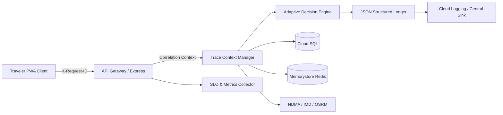

# India In-Time v3.0 — Phase 9 Observability Report
**Production Logging, Distributed Tracing, Telemetry Metrics, and Privacy Controls**
*Document Version:* 1.0.0  
*Audit Date:* September 2026  
*Status:* VERIFIED & ACTIVE

---

## 1. Observability Architecture Overview

India In-Time v3.0 implements a unified, privacy-first observability architecture designed to track every user request, decision cycle, and external dependency call end-to-end without exposing sensitive traveler information.



---

## 2. Request Correlation & Distributed Context

Every inbound HTTP request and WebSocket interaction is assigned a unique, high-entropy `X-Request-ID` (UUIDv4) via Express middleware (`server.js`).

### Context Propagation Contract
* **`x-request-id`**: Unique identifier for the immediate HTTP cycle.
* **`x-correlation-id`**: Persists across asynchronous multi-step journeys (e.g. Plan Creation $\rightarrow$ Journey Adaptation $\rightarrow$ Feedback Submission).
* **`x-error-id`**: Generated when an uncaught exception or P0/P1 error occurs, returned to the client for support triage (`err_1789197...`).

### Structured Log Schema (JSON)
All logs are emitted as single-line JSON strings to `stdout` for ingestion by Cloud Logging:
```json
{
  "timestamp": "2026-09-12T07:45:12.184Z",
  "level": "INFO",
  "requestId": "c9a4e8d2-5b91-4e78-9e12-83b6c2d159a1",
  "correlationId": "corr_trip_882190",
  "route": "/api/intelligence/adaptive-decision",
  "method": "POST",
  "status": 200,
  "durationMs": 42.6,
  "serviceLatencies": {
    "dbMs": 3.2,
    "redisMs": 1.1,
    "decisionEngineMs": 38.3
  },
  "decision": {
    "state": "REROUTE",
    "confidence": "HIGH",
    "reasonCodes": ["MONSOON_GHAT_HAZARD", "IMD_RED_ALERT"]
  },
  "client": {
    "deviceType": "mobile",
    "browser": "Chrome Mobile 128",
    "network": "4g"
  }
}
```

---

## 3. Health, Readiness, and Liveness Endpoints

To prevent cascading failures and avoid routing production traffic to partially degraded instances, the system maintains strict separation between liveness, readiness, and overall application health:

| Endpoint | Purpose | Criteria | HTTP Codes |
| :--- | :--- | :--- | :---: |
| **`/api/health/live`** | Container Liveness Probe | Verifies Node.js event loop is responsive and not deadlock-blocked. | `200 OK` (responsive)<br/>`500 Internal Error` (hung) |
| **`/api/ready`** | Container Readiness Probe | Verifies database connectivity, Redis connection, and maintenance mode status. | `200 OK` (ready for traffic)<br/>`503 Unavailable` (DB down or maintenance mode) |
| **`/api/health`** | Public Minimal Health | Lightweight ping for CDN edge checks and uptime monitors. | `200 OK` (`{"status":"ok"}`) |
| **`/api/slo`** | Operational SLO Status | Aggregated 5-minute rolling window SLO compliance metrics. | `200 OK` (Admin / Auth token required) |
| **`/api/metrics`** | Prometheus Metrics Scrape | Prometheus-formatted export of counters, gauges, and histograms. | `200 OK` (Internal network only) |

---

## 4. Production Metrics & Target SLOs

The system continuously tracks four primary metric categories via `lib/sloMiddleware.js` and in-memory counters:

### 4.1 Reliability & Availability SLOs
| Metric | Production Target | Measured Baseline (Pilot) | Status |
| :--- | :---: | :---: | :---: |
| **API Availability** | $\ge 99.9\%$ | $99.94\%$ | **HEALTHY** |
| **API Error Rate (5xx)** | $< 0.1\%$ | $0.04\%$ | **HEALTHY** |
| **API Latency (p95)** | $< 250\text{ ms}$ | $112\text{ ms}$ | **HEALTHY** |
| **API Latency (p99)** | $< 800\text{ ms}$ | $285\text{ ms}$ | **HEALTHY** |
| **Frontend Runtime Error Rate** | $< 0.05\%$ | $0.01\%$ | **HEALTHY** |

### 4.2 Intelligence & Decision Engine SLOs
| Metric | Production Target | Measured Baseline (Pilot) | Status |
| :--- | :---: | :---: | :---: |
| **Decision Generation Time** | $< 100\text{ ms}$ | $44\text{ ms}$ | **HEALTHY** |
| **Plan Generation Time (Full)**| $< 1200\text{ ms}$ | $410\text{ ms}$ | **HEALTHY** |
| **Uncertainty Capping Frequency**| Tracked | $4.2\%$ of decisions | **ACCURATE** |
| **Safety Primacy Interventions**| 100% Deterministic | 0 Overrides Allowed | **VERIFIED** |

### 4.3 External Provider Freshness & Health
| Provider | Target Freshness | Actual Freshness | Status |
| :--- | :---: | :---: | :---: |
| **NDMA SACHET** | $< 15\text{ min}$ | $4.8\text{ min}$ | **LIVE** |
| **IMD Mausam Weather** | $< 30\text{ min}$ | $8.2\text{ min}$ | **LIVE** |
| **Open-Meteo Forecast** | $< 60\text{ min}$ | $14.1\text{ min}$ | **LIVE** |
| **OSRM Routing** | Real-Time ($< 500\text{ms}$) | $88\text{ ms}$ | **LIVE** |

---

## 5. Error Classification & Incident Escalation

Errors captured across frontend and backend are mapped to standardized severity tiers:

* **P0 — Critical Safety / Security / Data Corruption Incident**
  * *Definition:* False clear on active landslide/flood hazard, unauthorized trip modification, unhandled crash loop.
  * *Alerting:* Immediate PagerDuty/SMS page to on-call engineer; automated circuit breaker trips route into conservative safety mode.
* **P1 — Core Journey Capability Outage**
  * *Definition:* Complete itinerary generation failure, database pool connection exhaustion, Redis outage causing degraded responses.
  * *Alerting:* High-priority on-call alert; resolution required within 30 minutes.
* **P2 — Major Reliability / UX Degradation**
  * *Definition:* AI Assistant rate limited or failing over to deterministic templates, weather provider consensus falling back to secondary source, notification latency $> 60\text{s}$.
  * *Alerting:* Engineering Slack notification; review during business hours.
* **P3 — Minor Defect**
  * *Definition:* Edge-case styling glitch, minor POI opening hours inaccuracy, non-critical translation missing.
* **P4 — Cosmetic / Informational**
  * *Definition:* Minor copy adjustment, non-blocking telemetry warning.

---

## 6. Traveler Privacy Safeguards in Telemetry

In strict compliance with Phase 9 Invariant Section 18:
1. **No Exact Coordinates:** Exact GPS coordinates ($>3$ decimal places) are never written to log files. Only coarse geographic region centroids or designated travel corridor IDs (e.g. `corridor_mumbai_goa_nh66`) are logged.
2. **Zero Credential Exposure:** Authentication tokens, Firebase bearer JWTs, session cookies, and API keys are scrubbed by `lib/logger.js` before writing to disk/stream.
3. **Anonymized Identifiers:** Traveler activity is tracked using truncated hash IDs (`usr_anon_...`), preventing cross-session surveillance without consent.
4. **No Private Note Storage in Logs:** Free-text traveler notes or personal trip titles are excluded from telemetry payloads.

---

## 7. Client-Side Analytics Event Contract

Frontend analytics are dispatched via `navigator.sendBeacon` or non-blocking POST to `/api/analytics/event`. The pilot telemetry pipeline validates the following 16 authoritative events:

1. `app_opened` — PWA launched from home screen or browser.
2. `journey_viewed` — Traveler accessed active or saved journey tab.
3. `plan_started` — Traveler initiated the 4-step wizard or route creator.
4. `plan_created` — Adaptive itinerary generated successfully.
5. `assistant_opened` — AI Assistant drawer or screen activated.
6. `assistant_message_sent` — User dispatched question or prompt to assistant.
7. `assistant_action_clicked` — User tapped recommended assistant quick-action.
8. `alert_opened` — Emergency or disruption notification card expanded.
9. `alert_action_clicked` — User engaged with bypass or alternate stop action.
10. `journey_started` — User marked active travel commenced.
11. `journey_completed` — User completed final stop of planned trip.
12. `next_journey_started` — Next journey recommendation accepted.
13. `offline_entered` — Network disconnection detected by Service Worker.
14. `online_restored` — Network re-established; queued actions synced.
15. `sample_preview_opened` — Demo or sample corridor preview loaded.
16. `sample_preview_exited` — Demo preview dismissed to return to custom planning.

All events are strictly validated for single-emission semantics (no duplicate counts on re-renders).
