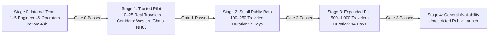
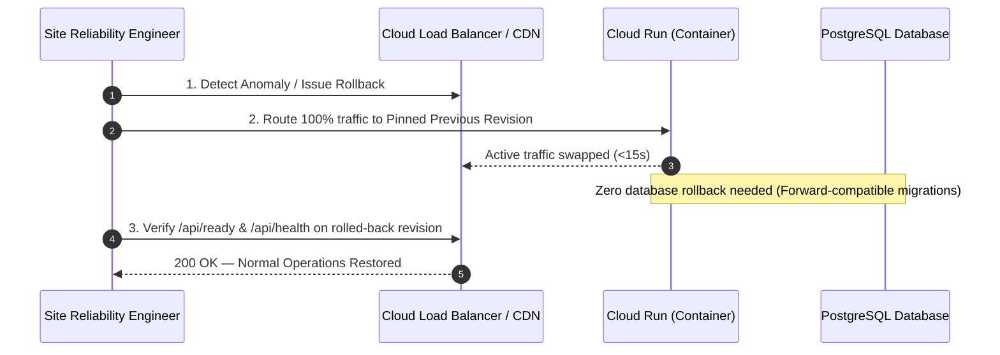

# India In-Time v3.0 — Phase 9 Rollout Plan
**Controlled Stage Progression, Feature Flags, Rollback Procedures, and Gate Criteria**
*Document Version:* 1.0.0  
*Audit Date:* September 2026  
*Status:* ACTIVE — STAGE 1 PILOT READY

---

## 1. Rollout Strategy & Staged Progression

In accordance with Phase 9 Section 27, **India In-Time v3.0 is not immediately exposed to the general public.** A phased, gate-driven progression guarantees that safety invariants, provider rate limits, database stability, and traveler experience are proven at each volume step.



### Stage Summary & Criteria

| Stage | Target Audience | Scale | Scope / Corridors | Success Criteria (Gate to Next Stage) |
| :---: | :--- | :---: | :--- | :--- |
| **Stage 0** | Internal Core Team & QA | 1–5 users | Synthetic & controlled test routes (Mumbai, Goa, Bangalore) | Zero P0/P1 errors; all 26 production check invariants pass; live safety provider smoke clean; database connection pool stable under load. |
| **Stage 1** | Trusted Traveler Pilot Group | 10–25 users | Real-world Western Ghats (Mumbai–Goa) & Karnataka Heritage (Bangalore–Mysore) | 100% safety primacy preservation; $> 85\%$ recommendation utility score; zero unhandled crashes; $< 0.1\%$ 5xx error rate; tested rollback rehearsal. |
| **Stage 2** | Small Public Beta (Invited) | 100–250 users | Maharashtra, Goa, Karnataka, Kerala, Rajasthan | p95 API latency $< 200\text{ms}$; zero false clears on severe weather alerts; feedback positive $> 80\%$; database CPU $< 40\%$. |
| **Stage 3** | Expanded Regional Pilot | 500–1,000 users | Pan-India major tourist circuits & monsoon corridors | Longitudinal stability verified over 14 days; cache hit ratio $> 90\%$; notification deduplication zero spam verified. |
| **Stage 4** | General Availability (GA) | Unrestricted | All supported Indian states and union territories | All SLO targets met continuously; automated disaster recovery and regional failover verified; multi-tier support active. |

---

## 2. Feature Flags & Operational Kill Switches

All non-essential or high-load capabilities are governed by runtime feature flags (`lib/featureFlags.js`), backed by Redis with local in-memory fallback. Flags can be toggled via admin API or environment variable overrides without redeploying code.

### Feature Flag Matrix

| Flag Name | Default State | Description | Safe Failure Behavior |
| :--- | :---: | :--- | :--- |
| **`assistantChat`** | `true` | Enables Google Gemini-powered conversational assistant in UI. | If disabled, Assistant tab displays pre-rendered FAQs and structured trip notes; zero conversational API calls. |
| **`liveAlerts`** | `true` | Enables real-time background polling for NDMA/IMD hazard warnings. | If disabled, UI displays last saved weather state with `OFFLINE_ADVISORY` label. |
| **`advancedNotifications`**| `true` | Dispatches smart adaptive push/PWA notifications for delays and detour havens. | If disabled, notifications are suppressed; advice remains visible inside active journey timeline. |
| **`experimentalUtilities`** | `false` | Beta utilities (e.g. crowd prediction heatmaps, advanced fuel estimators). | Completely hidden from UI when false; zero network overhead. |
| **`newProviderIntegrations`**| `false` | Experimental third-party transit APIs or crowd sensors. | System defaults exclusively to verified baseline providers (IMD, NDMA, OSRM). |
| **`maintenanceMode`** | `false` | Global operational circuit breaker. | Inbound requests receive friendly traveler maintenance screen; `/api/ready` returns 503. |

### Absolute Invariant on Flags
**A feature flag can never be used to bypass safety.**
Safety policies (`adaptiveDecisionEngine.js`, `safetyRiskEngine.js`) are deterministic, compiled core code. They cannot be turned off by any flag. A disabled feature must unconditionally fail safe.

---

## 3. Rollback Procedures & Runbooks

Every production deployment must be 100% rollback-capable within 60 seconds without data corruption.



### 3.1 Application Rollback
Containerized deployments on Cloud Run utilize revision pinning:
```bash
# Instant traffic shift to known healthy revision
gcloud run services update-traffic india-in-time-prod \
  --to-revisions=REV_PREVIOUS_STABLE=100
```
*Time to execute:* $< 15\text{ seconds}$.

### 3.2 Database Migration Forward-Fix Strategy
**Destructive database rollbacks (e.g. `knex migrate:rollback` dropping tables or columns in production) are strictly forbidden during live traveler traffic.**
* All schema changes must follow the **Expand and Contract** pattern:
  1. *Phase 1 (Expand):* Add new nullable or default columns.
  2. *Phase 2 (Dual-Write):* Application reads and writes both old and new columns.
  3. *Phase 3 (Contract):* Remove legacy column in a subsequent release after verification.
* If a migration bug occurs, a forward-fix migration (`npm run migrate`) is deployed to resolve the issue without dropping existing traveler records.

### 3.3 Configuration & Secret Rollback
If a faulty configuration or API key is deployed:
1. Revert environment variable in GCP Secret Manager / Cloud Run configuration.
2. Cloud Run immediately instantiates a clean revision.
3. Verify via `node scripts/production-config-smoke.js`.

---

## 4. Rollout Governance & Change Control

1. **Zero Direct Production Hot-Patching:** No code modifications may be made directly on production servers or containers.
2. **Mandatory CI/CD Pipeline Gates:**
   * Architecture check passes (`node scripts/architecture-check.js`)
   * Inline handlers check passes (`node scripts/check-inline-handlers.js`)
   * Bundle size within 1.5MB budget (`node scripts/check-bundle-size.js`)
   * Full Jest test suite passes (`npm test`)
   * Full Playwright end-to-end suite passes (`npx playwright test`)
3. **Emergency Fix Protocol:** Any emergency fix during active pilot must be committed to a hotfix branch, reviewed by at least one secondary engineer, tested in staging, and deployed through the automated pipeline.
