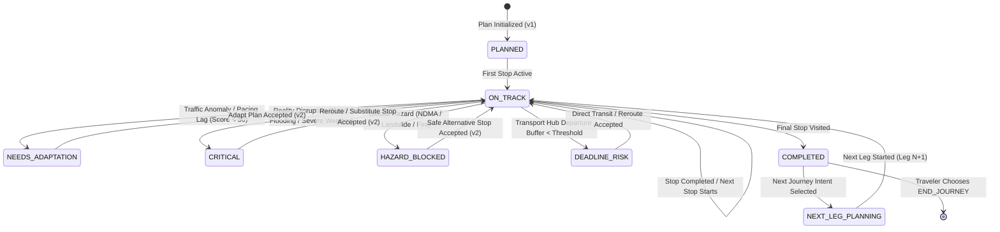

# INDIA IN-TIME v3.0 — STATE INTEGRITY AUDIT

## 1. Database Schema & Migration Invariant Verification

The PostgreSQL database architecture is defined canonically in `db/schema.js` and tracked version-by-version across 7 migration files in `migrations/`:

| Migration File | Primary Tables / Alterations Created | Invariant Enforced | Status |
|---|---|---|---|
| `1700000000000_baseline-schema.js` | `trips`, `favorites`, `api_usage`, `place_cache`, `ai_cache`, `place_feedback`, `app_feedback` | Baseline relational schema with `IF NOT EXISTS` | **VERIFIED** |
| `1700000001000_soft-delete-and-historical-crowd.js` | `deleted_at` on `trips`/`favorites`, `historical_crowd` | Non-destructive soft delete & crowd telemetry | **VERIFIED** |
| `1700000002000_gemini-usage.js` | `gemini_usage` | Token, model, latency and cost tracking | **VERIFIED** |
| `1700000003000_ml-model-weights.js` | `ml_model_weights` | Persistent weights for crowd logistic model | **VERIFIED** |
| `1700000004000_audit-log.js` | `audit_log` | Security audit trail for admin actions | **VERIFIED** |
| `1700000005000-production-hardening.js` | Performance indexes on `api_usage`, `place_cache` | High-load query index optimization | **VERIFIED** |
| `1700000006000_travel-operating-system.js` | `journey_state`, `plan_versions`, `adaptation_events`, `safety_signals`, `safety_evaluations`, `safety_notifications`, `experience_evaluations`, `trust_entities`, `trust_claims`, `trust_evidence`, `trust_verifications`, `journey_legs`, `journey_leg_destinations`, `next_leg_intents`, `next_leg_candidates`, `next_leg_evaluations`, `next_leg_decisions`, `next_leg_outcomes` | India In-Time v3.0 full relational state machine | **VERIFIED** |

---

## 2. Invariant: Immutability of Completed Journey Stops & Legs

> [!IMPORTANT]
> **CRITICAL ARCHITECTURAL LAW**:  
> Once a journey stop or leg is marked `COMPLETED`, it enters an immutable historical state. Under no circumstances may an adaptive replan, reality disruption, or user re-route alter, delete, or re-time a completed stop.

### Code Verification:
1. In `services/travelIntelligence/decision/adaptationPipeline.js`:
   ```javascript
   // 1. Preserve Completed Stops (IMMUTABLE)
   const completedStops = journeyState.stops.filter(s => s.status === STOP_STATUSES.COMPLETED);
   const preservedNames = completedStops.map(s => s.name);
   ...
   const finalStops = [...completedStops, ...newUpcomingStops];
   ```
2. In `services/travelIntelligence/journey/journeyStateEngine.js`:
   ```javascript
   if (existingStop.status === STOP_STATUSES.COMPLETED) {
     return state; // No-op: Completed stop is already immutable
   }
   ```
3. In `services/travelIntelligence/nextJourney/journeyLegModel.js`:
   - Completed legs have `status = 'COMPLETED'` and `completed_at` timestamp.
   - New legs are strictly appended with incremental `leg_number` pointing to `parent_leg_id`.
   - Completed legs cannot be deleted during onward planning.

---

## 3. Journey State Lifecycle Transitions



---

## 4. Notification & Alert State Machine

The unified notification system in `disruptionNotificationEngine.js` and `alertsCenter.js` governs all alerts:

1. **DETECTED**: An anomaly or official feed triggers an alert condition.
2. **ACTIVE**: Alert is active on the trip HUD with calculated urgency and user action buttons.
3. **ESCALATED**: Condition worsens (e.g. traffic delay increases beyond 30 min, hazard severity reaches SEVERE or CRITICAL).
4. **STALE**: Feed telemetry is older than freshness threshold (e.g. IMD forecast > 3h, traffic > 20m). Explicitly tagged as `STALE`.
5. **EXPIRED**: The scheduled event or temporal hazard window has elapsed.
6. **RESOLVED**: Hazard cleared, traffic normalized, or traveler accepted safer adaptation.

**Alert Priority Enforcement**:
`SAFETY > DEADLINE > MAJOR DISRUPTION > TRUST > JOURNEY VALUE > INFORMATION`
No lower-priority notification may displace a higher-priority safety or transport deadline alert.

---

## 5. Next Journey Chaining & Data Isolation

1. **Continuous Chaining**:
   - `journey_legs` tracks each leg with `(journey_id, leg_number)`.
   - `parent_leg_id` links Leg 2 to Leg 1, establishing a complete provenance chain.
2. **Private Location Masking**:
   - When a user selects `RETURN_HOME`, `destinationIntentResolver.js` resolves coordinates for distance and routing calculations while setting `isPrivateLocation: true` and omitting the private address from telemetry logs and shared URLs.
3. **Tenant & User Isolation**:
   - All journey state and next-leg persistence is validated against `req.uid` to ensure User A's trips, alerts, and profiles cannot be accessed or altered by User B.
