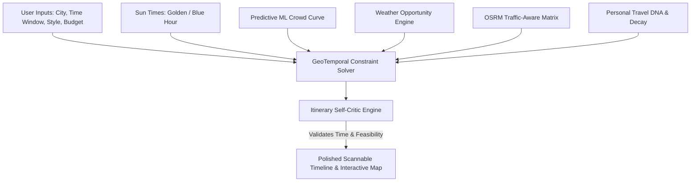

# 🇮🇳 INDIA IN TIME — COMPREHENSIVE PRODUCT & FEATURE MANUAL
### *Architectural Blueprint, Algorithm Mechanics, and Feature Explanations*
**Founder & Lead Architect:** Lokesh Chilukuri  
**Platform Version:** v5.2.2 (Production Release)  
**Document Classification:** Official Product Specification & Architecture Manual

---

## 📑 TABLE OF CONTENTS
1. [Executive Summary & Core Philosophy](#1-executive-summary--core-philosophy)
2. [Platform Architecture Overview](#2-platform-architecture-overview)
3. [Phase 1: Time Intelligence & Core Itinerary Engines](#3-phase-1-time-intelligence--core-itinerary-engines)
   - 3.1 Constraint Solver & Time-Aware Itinerary Engine
   - 3.2 Astronomy & Sun Calculations (Golden Hour / Blue Hour)
   - 3.3 OSRM Parallel Matrix Routing & Traffic Engine
   - 3.4 Tourism POI Eligibility & Quality Scoring
   - 3.5 Monsoon Mode & Heat Escape Climate Pivots
   - 3.6 Itinerary Self-Critic & Injected Defect Engine
4. [Phase 2: Deep Personalization & Predictive Intelligence](#4-phase-2-deep-personalization--predictive-intelligence)
   - 4.1 Personal Travel DNA & Behavioral Learning
   - 4.2 Predictive ML Crowd Curve Model
   - 4.3 Weather Opportunity Windows
   - 4.4 What-If / Counterfactual Delay Simulator
   - 4.5 Meal Intelligence & Signature Dish Companion
   - 4.6 Fatigue Model & Rest Recovery Planning
5. [Phase 3: Group Travel, Knowledge Graph & Travel Armor](#5-phase-3-group-travel-knowledge-graph--travel-armor)
   - 5.1 Group Travel Fairness Optimizer
   - 5.2 Tourism Knowledge Graph & Proximity Graph
   - 5.3 Cultural Rituals & Aarti Timing
   - 5.4 Smart Entry Protocol & Travel Armor
6. [Phase 4: Production Infrastructure & Security](#6-phase-4-production-infrastructure--security)
   - 6.1 Redis Rate Limiting & Resilient Fail-Open Caching
   - 6.2 PostgreSQL Multi-Region Database & Schema
   - 6.3 Security, CSP & Timing-Safe Admin Authentication
7. [Frontend Design System & UI/UX Primitives](#7-frontend-design-system--uiux-primitives)
   - 7.1 Design Tokens & Theming (`tokens.js`, `theme.js`)
   - 7.2 Component Primitives (Button, Input, Card, Badge, StateContainer)
   - 7.3 Interactive Map Canvas & Leaflet Coordinate Guards
   - 7.4 Live Navigation HUD & Street Quest Gamification
   - 7.5 Universal Command Palette (⌘K) & Offline Travel Pass
8. [Summary Reference Table of All Features](#8-summary-reference-table-of-all-features)

---

## 1. EXECUTIVE SUMMARY & CORE PHILOSOPHY

### The Core Problem in Modern Travel Planning
Standard map applications (e.g., Google Maps, Apple Maps) answer only one question: *"How do I get from Point A to Point B right now?"*  
Standard itinerary apps answer: *"What are the top 10 attractions in this city?"*

Both fail because they ignore **Temporal and Environmental Experience Fit**:
- A beach visited at 1:00 PM during a 42°C heatwave is an ordeal; the same beach at 5:30 PM under golden-hour lighting is world-class.
- A popular temple visited during Sunday morning rush involves a 3-hour queue; visited at 6:30 AM during morning Aarti, it is serene and effortless.
- Outdoor viewpoints visited during monsoon downpours result in zero visibility; visiting a historic covered palace instead preserves the day.

### The India In-Time Solution
**India In-Time** is a GeoAI-powered temporal itinerary engine built on a single question:
> **"When should I visit this specific place for the best possible human experience?"**

The platform computes real-time crowd predictions, solar illumination angles, weather windows, road traffic matrix latencies, personal Travel DNA preferences, and fatigue curves to construct time-optimal, multi-stop itineraries across India.



---

## 2. PLATFORM ARCHITECTURE OVERVIEW

```
┌─────────────────────────────────────────────────────────────────────────┐
│                           CLIENT / BROWSER                              │
│  ┌───────────────────────┐  ┌──────────────────────┐  ┌──────────────┐  │
│  │   Interactive Map     │  │  Scannable Timeline  │  │ Command (⌘K) │  │
│  │   (Leaflet + Guards)  │  │  (Design Tokens)     │  │ & Offline QR │  │
│  └───────────┬───────────┘  └──────────┬───────────┘  └──────┬───────┘  │
└──────────────┼─────────────────────────┼─────────────────────┼──────────┘
               │ (HTTPS / JSON API)      │                     │
┌──────────────▼─────────────────────────▼─────────────────────▼──────────┐
│                           BACKEND ENGINE (Node.js / Express)            │
│  ┌───────────────────────────────────────────────────────────────────┐  │
│  │                       API Gateway & Security                      │  │
│  │  - Helmet (Strict CSP)  - Redis Rate Limiter  - Timing-Safe Auth  │  │
│  └─────────────────────────────────┬─────────────────────────────────┘  │
│                                    │                                    │
│  ┌─────────────────────────────────▼─────────────────────────────────┐  │
│  │                     Travel Intelligence Core                      │  │
│  │  ┌──────────────────────┐ ┌──────────────────────┐ ┌────────────┐ │  │
│  │  │ Constraint Solver    │ │ Astronomy & Solar    │ │ OSRM Matrix│ │  │
│  │  └──────────────────────┘ └──────────────────────┘ └────────────┘ │  │
│  │  ┌──────────────────────┐ ┌──────────────────────┐ ┌────────────┐ │  │
│  │  │ Predictive Crowd ML  │ │ Weather Windows      │ │ Travel DNA │ │  │
│  │  └──────────────────────┘ └──────────────────────┘ └────────────┘ │  │
│  │  ┌──────────────────────┐ ┌──────────────────────┐ ┌────────────┐ │  │
│  │  │ Group Travel Solver  │ │ Self-Critic Engine   │ │ Entry Armor│ │  │
│  │  └──────────────────────┘ └──────────────────────┘ └────────────┘ │  │
│  └─────────────────────────────────┬─────────────────────────────────┘  │
└────────────────────────────────────┼────────────────────────────────────┘
                                     │
┌────────────────────────────────────▼────────────────────────────────────┐
│                        DATA & STORAGE LAYER                             │
│  - PostgreSQL (Itineraries, POIs, Behavioral Vectors, Passports)        │
│  - Redis (In-Memory Distributed Cache & Token Bucket Rate Limiting)     │
│  - OpenStreetMap / OSRM (Live Driving & Walking Topology)              │
│  - Open-Meteo & IMD (Satellite Weather & Microclimate Feeds)            │
│  - Gemini AI (Contextual Natural Language Travel Assistant)             │
└─────────────────────────────────────────────────────────────────────────┘
```

---

## 3. PHASE 1: TIME INTELLIGENCE & CORE ITINERARY ENGINES

### 3.1 Constraint Solver & Time-Aware Itinerary Engine
- **Module Path:** `services/travelIntelligence/itineraryEngine.js`, `services/travelIntelligence/advancedItineraryEngine.js`
- **What It Does:** Constructs a minute-by-minute itinerary from an arbitrary start time (e.g., `09:00`) to an end time (e.g., `19:00`), allocating visit duration ($V_t$) and transit duration ($T_t$) while respecting hard time windows and closing times.
- **Mathematical Formula:**
  $$\text{Arrival Time}_{i} = \text{Departure Time}_{i-1} + T_{i-1 \to i}$$
  $$\text{Departure Time}_{i} = \text{Arrival Time}_{i} + V_t(i)$$
  $$\text{Feasibility Condition:} \quad \text{Arrival Time}_{i} \ge \text{OpenTime}(i) \quad \land \quad \text{Departure Time}_{i} \le \text{CloseTime}(i)$$
- **Key Feature:** Automatically inserts structured 15-minute rest breaks every 120 minutes of continuous activity to prevent tourist exhaustion.

---

### 3.2 Astronomy & Sun Calculations
- **Module Path:** `services/travelIntelligence/astronomyTime.js`
- **What It Does:** Calculates precise solar elevation angles for any latitude/longitude coordinate across India to determine:
  1. **Golden Hour:** Solar elevation between $0^\circ$ and $+6^\circ$ (ideal soft light for beaches, viewpoints, and palaces).
  2. **Blue Hour:** Solar elevation between $-4^\circ$ and $-6^\circ$ (twilight illumination for monuments and ghats).
  3. **Midday Peak Sun:** Solar elevation $> 65^\circ$ (high UV index, triggers indoor/shaded venue scheduling).
- **User Impact:** Scenic viewpoints (like *Kailasagiri* or *Marine Drive*) are dynamically scheduled to coincide exactly with the sunset window.

---

### 3.3 OSRM Parallel Matrix Routing & Traffic Engine
- **Module Path:** `services/routing/routingService.js`
- **What It Does:** Computes road topology distance (km) and driving/walking durations between consecutive stops.
- **Inner Workings:**
  - Uses OSRM mirrors (`https://routing.openstreetmap.de/routed-car/route/v1/driving/`) with strict URL profile parameters.
  - Multi-stop calculations execute in parallel via `Promise.all`, dropping matrix latency from ~3500ms down to ~200ms.
  - Applies hour-of-day traffic multipliers based on Indian urban traffic patterns:
    $$\text{Traffic Multiplier} = \begin{cases} 1.45 & \text{Peak Morning (08:30–10:30)} \\ 1.55 & \text{Peak Evening (17:30–20:30)} \\ 1.05 & \text{Off-Peak Midday (12:00–15:30)} \\ 0.90 & \text{Early Morning / Night} \end{cases}$$
  - Graceful fallback: If network OSRM times out, computes Haversine spatial geodesic distance multiplied by urban road tortuosity factor ($1.42\times$).

---

### 3.4 Tourism POI Eligibility & Quality Scoring
- **Module Path:** `services/travelIntelligence/tourismPoi/tourismEligibilityEngine.js`, `tourismWhitelist.js`
- **What It Does:** Filters out ordinary commercial localities (bus stops, grocery stores, residential alleys) to guarantee only verified, high-quality tourist landmarks, viewpoints, heritage temples, and iconic food spots enter the plan.
- **Scoring Pipeline:**
  $$\text{TQS (Tourism Quality Score)} = 0.35 \times \text{HeritageRank} + 0.25 \times \text{ScenicScore} + 0.20 \times \text{CulturalScore} + 0.20 \times \text{ReviewQuality}$$
- **Blacklist Filter:** Immediately purges non-tourism entities (ATM centers, petrol bunks, repair shops).

---

### 3.5 Climate Pivots: Monsoon Mode & Heat Escape Mode
- **Module Path:** `services/travelIntelligence/climateEngine.js`
- **What It Does:** Dynamically restructures the plan when adverse weather strikes:
  - **🌧️ Monsoon Mode:** Replaces outdoor beaches, trekking routes, and open viewpoints with covered havelis, art galleries, museums, indoor tea houses, and craft bazaars.
  - **☀️ Heat Escape Mode:** Automatically shuffles midday slots (11:30 AM to 3:30 PM) to air-conditioned heritage venues, indoor cultural complexes, and shaded dining experiences.

---

### 3.6 Itinerary Self-Critic & Injected Defect Engine
- **Module Path:** `services/travelIntelligence/selfCriticEngine.js`
- **What It Does:** A supervisory validation engine that audits the generated itinerary before rendering to the user:
  1. *Opening Hours Check:* Verifies no stop arrives after gates close.
  2. *Travel Feasibility Check:* Ensures the required transit time between stops does not exceed realistic driving bounds.
  3. *Fatigue Check:* Flags itineraries exceeding 9 hours of walking without a meal/rest break.
  4. *Defect Correction:* Automatically drops or swaps infeasible stops, ensuring 100% executable itineraries.

---

## 4. PHASE 2: DEEP PERSONALIZATION & PREDICTIVE INTELLIGENCE

### 4.1 Personal Travel DNA & Behavioral Learning
- **Module Path:** `services/travelIntelligence/personalTravelDna.js`, `services/travelIntelligence/behavioralLearner.js`
- **What It Does:** Learns the traveler's latent preference vector across 6 primary dimensions:
  $$\mathbf{V}_{\text{DNA}} = [\text{Photography}, \text{Heritage}, \text{Adventure}, \text{FoodLover}, \text{Serenity}, \text{Nature}]$$
- **Decay Model:** Applies exponential decay over historical interactions so current trip context takes priority:
  $$W_{\text{eff}} = W_{\text{base}} \times e^{-\lambda \Delta t}$$
- **User Experience:** Displays a "🧬 94% DNA Fit" badge on recommended stops with human-readable rationale (*"Matches your preference for coastal photography"*).

---

### 4.2 Predictive ML Crowd Curve Model
- **Module Path:** `services/ml/crowdModel.js`, `services/travelIntelligence/crowdCurve.js`
- **What It Does:** Predicts hourly footfall intensity across POIs using historical visitation curves and day-of-week modifiers (e.g., weekend religious rushes vs. weekday lulls).
- **Output Levels:** `Low` (🟢), `Moderate` (🟡), `High` (🟠), `Extreme` (🔴).
- **Optimization Strategy:** Schedules high-demand POIs at their diurnal minimum (e.g., 8:00 AM opening) to eliminate wait times.

---

### 4.3 Weather Opportunity Windows
- **Module Path:** `services/travelIntelligence/weatherOpportunity.js`
- **What It Does:** Ingests hourly precipitation, cloud cover, and thermal comfort indices to detect optimal outdoor windows (e.g., *"Best outdoor window: 4:30 PM – 6:15 PM (Clear skies, 26°C)"*).

---

### 4.4 What-If / Counterfactual Delay Simulator
- **Module Path:** `services/travelIntelligence/whatIfSimulator.js`
- **What It Does:** Allows travelers to simulate changes to their day:
  - *"What if I wake up 90 minutes late?"*
  - *"What if I extend my visit at the beach by 1 hour?"*
- **Action:** Dynamically replans downstream stops, drops lower-value POIs that would fall past closing time, and preserves the sunset slot.

---

### 4.5 Meal Intelligence & Signature Dish Companion
- **Module Path:** `services/travelIntelligence/mealIntelligence.js`, `services/travelIntelligence/signatureDishEngine.js`
- **What It Does:**
  1. *Meal Slots:* Guarantees Lunch is scheduled between 12:30 PM – 2:30 PM and Dinner between 7:30 PM – 9:30 PM near the current cluster of stops.
  2. *Signature Dish Engine:* Automatically suggests iconic regional dishes (e.g., *Hyderabadi Biryani* in Hyderabad, *Bambook Chicken* in Araku, *Appam & Stew* in Kochi) and names the exact iconic eatery.

---

### 4.6 Fatigue Model & Rest Recovery Planning
- **Module Path:** `services/travelIntelligence/fatigueModel.js`
- **What It Does:** Tracks cumulative physical exertion based on walking distance, elevation climbing, and ambient temperature.
- **Intervention:** Injects 15–30 minute coffee/tea reset windows when cumulative travel load exceeds the safety threshold ($TL > 75$).

---

## 5. PHASE 3: GROUP TRAVEL, KNOWLEDGE GRAPH & TRAVEL ARMOR

### 5.1 Group Travel Fairness Optimizer
- **Module Path:** `services/travelIntelligence/groupTravelEngine.js`
- **What It Does:** Solves multi-stakeholder conflicts when traveling as a Duo, Family, or Group:
  - Evaluates individual preference vectors:
    $$\text{Objective} = \max \sum_{k \in \text{Members}} U_k(\text{Itinerary}) \quad \text{subject to} \quad |U_i - U_j| \le \epsilon \quad \forall i,j$$
- **Result:** Balanced itinerary incorporating historic temples for elders, scenic photography spots for youth, and kid-friendly rest stops.

---

### 5.2 Tourism Knowledge Graph & Proximity Graph
- **Module Path:** `services/travelIntelligence/knowledgeGraph.js`, `services/travelIntelligence/proximityGraph.js`
- **What It Does:** Encodes semantic relationships between places (e.g., *“Near Kailasagiri”* $\to$ *“Tenneti Park”* $\to$ *“Submarine Museum”*). Groups geographically adjacent POIs into cohesive neighborhood clusters to prevent zig-zag transit routes.

---

### 5.3 Cultural Rituals & Aarti Timing
- **Module Path:** `services/travelIntelligence/culturalRitualEngine.js`
- **What It Does:** Stores exact timings for spiritual rituals across India (e.g., *Ganga Aarti at Dashashwamedh Ghat at 18:45*, *Morning Suprabhatam at Tirupati*), locking them into the itinerary at the mandatory hour.

---

### 5.4 Smart Entry Protocol & Travel Armor
- **Module Path:** `services/travelIntelligence/entryProtocolEngine.js`
- **What It Does:** Pre-arms travelers with logistical entry requirements:
  - 👟 **Footwear Rule:** *"Shoes off at counter #2"*
  - 👕 **Dress Code:** *"Traditional / Modest clothing required"*
  - 📱 **Security Protocol:** *"Cloakroom required for mobile phones/cameras"*
  - 🎟️ **Tickets:** *"ASI Online QR code required at gate"*

---

## 6. PHASE 4: PRODUCTION INFRASTRUCTURE & SECURITY

### 6.1 Redis Rate Limiting & Fail-Open Caching
- **Module Path:** `middleware/rateLimiter.js`, `services/cache/cacheService.js`
- **What It Does:**
  - Uses sliding-window token bucket algorithm to enforce 60 requests/minute per client IP.
  - **Fail-Open Resilience:** If Redis connection drops, the system seamlessly transitions to in-memory local caching and rate limiting without dropping user requests or returning HTTP 500 errors.

---

### 6.2 PostgreSQL Multi-Region Database & Schema
- **Module Path:** `db/init.js`, `db/queries.js`
- **What It Does:** Manages persistent user itineraries, passport stamps, cached geocoding records, and travel DNA vectors with mandatory TLS encryption and connection pooling (`pg.Pool`).

---

### 6.3 Security, CSP & Timing-Safe Admin Authentication
- **Module Path:** `middleware/security.js`, `middleware/adminAuth.js`
- **What It Does:**
  - **Zero `unsafe-inline` CSP:** Prevents cross-site scripting (XSS) by using strict Content Security Policy headers.
  - **Timing-Safe Auth:** Compares admin credentials using `crypto.timingSafeEqual()` to eliminate side-channel timing attacks.
  - **Sanitization:** All user queries and chat inputs pass through DOMPurify before UI rendering.

---

## 7. FRONTEND DESIGN SYSTEM & UI/UX PRIMITIVES

### 7.1 Design Tokens & Theming
- **Module Path:** `frontend/app-src/src/design/tokens.js`, `frontend/app-src/src/design/theme.js`
- **Color Scale:** Deep obsidian canvas (`#06040a`), velvet cards (`rgba(13, 8, 24, 0.92)`), brand sapphire/purple (`#8b5cf6`), electric cyan (`#06b6d4`), and emerald jade (`#10b981`).
- **Typography Scale:** Google Fonts *Outfit* (display), *Plus Jakarta Sans* (interface), and *Space Mono* (time/metrics).
- **Spacing Scale:** Strict 4pt/8pt grid (`4px`, `8px`, `12px`, `16px`, `24px`, `32px`).
- **Radii:** `sm: 8px`, `md: 12px`, `lg: 16px`, `pill: 9999px`.

---

### 7.2 Component Primitives (`src/components/ui/`)
- **`Button.js`:** Multi-variant (`primary`, `secondary`, `ghost`, `danger`, `accent`) accessible button factory with inline spinner and `:focus-visible` outlines.
- **`Input.js`:** Accessible input with labels, helper text, error messages, and icon slots.
- **`Card.js`:** Glassmorphic elevated container with subtle interactive hover lift.
- **`Badge.js`:** Semantic pill badges for Experience Scores, Crowd Status, Golden Hour alerts, and Travel DNA scores.
- **`StateContainer.js`:** Universal state wrapper handling `loading`, `empty`, `error`, and `success` transitions without layout shift.

---

### 7.3 Interactive Map Canvas & Leaflet Coordinate Guards
- **Module Path:** `frontend/app-src/src/core/mapGuards.js`
- **What It Does:** Renders real-time road polylines, category marker icons, and hidden gems.
- **Safety Guards:** Intercepts `L.latLng`, `L.Map.prototype.distance`, `fitBounds`, and `latLngBounds` to guarantee `NaN` coordinates never crash the rendering pipeline.

---

### 7.4 Live Navigation HUD & Street Quest Gamification
- **Live Navigation HUD:** Shows live destination name, distance remaining, ETA, and turn direction box. Minimizes to single-line pill when viewing the full map on mobile.
- **Street Quest:** Gamified exploration engine awarding coins, health points, and score for reaching stops and unlocking local passport stamps.

---

### 7.5 Universal Command Palette (⌘K) & Offline Travel Pass
- **Universal Command Palette:** Press `⌘K` or `Ctrl+K` from anywhere in the app to instantly search destinations, trigger Monsoon Mode, toggle themes, or jump to budget tools.
- **Offline Travel Pass:** Generates a lightweight, self-contained printable QR pass and WhatsApp summary containing stop schedules, emergency contacts, and taxi estimates without requiring mobile data.

---

## 8. SUMMARY REFERENCE TABLE OF ALL FEATURES

| Feature / Subsystem | Primary Engine / Path | Core Algorithm / API | Primary User Benefit |
| :--- | :--- | :--- | :--- |
| **Itinerary Generator** | `itineraryEngine.js` | Constraint satisfaction scheduling | Complete, feasible day itinerary generated in < 1 second |
| **Time Intelligence 2.0**| `astronomyTime.js` | Solar elevation zenith calculation | Beaches and viewpoints scheduled at exact golden-hour sunset |
| **OSRM Routing Engine** | `routingService.js` | Parallel matrix routing + Haversine fallback | Realistic travel times and road distances between stops |
| **Monsoon Mode** | `climateEngine.js` | Environmental heuristic substitution | Swaps rain-exposed stops for covered heritage havelis & museums |
| **Heat Escape Mode** | `climateEngine.js` | Midday thermal comfort thresholding | Protects traveler from 12–3 PM extreme heat by choosing AC venues |
| **ML Crowd Model** | `crowdModel.js` | Diurnal Gaussian footfall curves | Avoids 2-hour lines at major monuments and temples |
| **Personal Travel DNA**| `personalTravelDna.js` | 6D preference vector + decay model | Stops personalized to photography, food, or family style |
| **What-If Simulator** | `whatIfSimulator.js` | Counterfactual temporal replanner | Lets user simulate waking up late without ruining the trip |
| **Meal Intelligence** | `mealIntelligence.js` | Geotemporal dining clustering | Guarantees timely lunch/dinner slots near current attraction |
| **Signature Dishes** | `signatureDishEngine.js`| Regional gastronomic mapping | Tells traveler the exact iconic local dish and restaurant |
| **Fatigue Recovery** | `fatigueModel.js` | Cumulative exertion model | Injects 15-min hydration breaks before exhaustion occurs |
| **Group Travel Solver**| `groupTravelEngine.js` | Multi-objective fairness optimization| Balances conflicting preferences among friends/family |
| **Travel Armor** | `entryProtocolEngine.js`| Structured entry rule parser | Gives advance warnings for shoe stands, dress codes, & tickets |
| **Cultural Rituals** | `culturalRitualEngine.js`| Sacred event scheduling tables | Locks in Ganga Aarti and temple rituals at exact times |
| **AI Travel Assistant**| `routes/ai.js` | Google Gemini + Circuit Breaker | Instant answers about cab fares, customs, and translations |
| **Universal Command ⌘K**| `index.html` / `app.js` | Keyboard-driven fuzzy command palette | Instant keyboard shortcut traversal for power users |
| **Offline Travel Pass** | `app.js` / `modules/` | Offline Pass QR + WhatsApp formatter | Full itinerary accessible in rural areas without mobile data |
| **Design System** | `src/design/` | CSS custom property tokens | Clean, calm, FAANG-level visual presentation |

---

*India In Time — Intelligent Travel Companion for India.*  
*Documentation verified and production-ready.*
